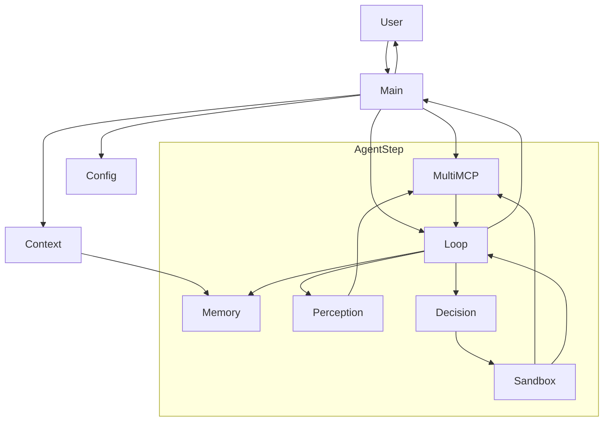

# Hybrid-Agent-Planner
A fully agentic Hybrid Planning system using LLM reasoning + heuristic guardrails + adaptive Python plans + memory-aware decision making. Includes conservative strategy execution, tool sandboxing, historical conversation indexing, and introspection-driven multi-step planning.

## 🧠 System Architecture

#### 1. High level

This project is a **Hybrid Planning Agent**:

> User query → Perception (LLM) → Tool selection (MultiMCP) → Decision (LLM plan) → Python sandbox → MCP tools → Memory → Final answer

The agent runs in **discrete steps**. At each step it:

1. Understands the query and picks tool servers (**Perception**).
2. Chooses which tool to call and writes Python glue code (**Decision / Planning**).
3. Executes that Python code in a sandbox that can only talk to tools (**Action**).
4. Updates its **Memory** and either:

   * finishes with `FINAL_ANSWER: ...`, or
   * continues with `FURTHER_PROCESSING_REQUIRED: ...` and another step.

#### 2. Architecture diagram (Mermaid)



### 🔍 What each node stands for 

| Node           | Meaning                                                     |
| -------------- | ----------------------------------------------------------- |
| **User**       | CLI user typing a query                                     |
| **Main**       | `agent.py`                                                  |
| **Config**     | `models.json` + `profiles.yaml`                             |
| **Context**    | `AgentContext` (state, strategy, memory linkage)            |
| **MultiMCP**   | Tool dispatcher loading all MCP servers                     |
| **Loop**       | `AgentLoop.run()` (perception → decision → action → memory) |
| **Perception** | `modules/perception.py` LLM intent + server selection       |
| **Decision**   | `modules/decision.py` LLM writes Python solve() code        |
| **Sandbox**    | `modules/action.py` executes plan safely                    |
| **Memory**     | `modules/memory.py` logging, success history                |

---

#### 3. Components

* **`agent.py`**
  CLI entry point.

  * Loads `profiles.yaml` and `models.json`.
  * Creates a shared `MultiMCP` dispatcher and calls `initialize()` to discover tools from all MCP servers.
  * For each user query:

    * Builds an `AgentContext` (user input, session id, strategy profile, dispatcher, memory manager).
    * Creates an `AgentLoop(context)` and awaits `run()`.
    * Handles:

      * `FINAL_ANSWER: ...` → print and finish.
      * `FURTHER_PROCESSING_REQUIRED: ...` → feed that back in as the next `user_input` and keep going.

* **`core/context.py`**
  Holds **all state** for a run:

  * `AgentProfile` and `StrategyProfile` are loaded from `profiles.yaml` (planning mode, max steps, lifelines, memory flags).
  * `AgentContext` tracks:

    * `user_input`, `session_id`, `step`
    * `agent_profile` (strategy and persona)
    * `memory = MemoryManager(session_id=...)`
    * `dispatcher` (the shared `MultiMCP`)
    * `mcp_server_descriptions` (for perception prompt)
    * `task_progress` (simple introspection: per step tool + status)
    * `final_answer`
  * Provides helpers like `add_memory`, `log_subtask`, and `update_subtask_status`.

* **`core/session.py`** – MCP dispatch layer

  * `MCP` wraps a single FastMCP server, using `ClientSession` over stdio to:

    * `list_tools()`
    * `call_tool(name, arguments)`
  * `MultiMCP` aggregates all servers from `profiles.yaml`:

    * At `initialize()` time it starts each server once, calls `list_tools()`, and builds:

      * `tool_map[tool_name] = {config, tool}`
      * `server_tools[server_id] = [tools...]`
    * At runtime:

      * `call_tool(tool_name, arguments)` runs the specific server script via stdio and calls that tool.
      * `get_tools_from_servers(selected_servers)` returns tool objects that perception decided to use.

* **`modules/perception.py`** – Perception

  * Builds a prompt from `perception_prompt.txt` with the list of available MCP servers and the user query.
  * Uses `ModelManager` (Gemini or Ollama) to generate a JSON block with:

    * `intent`, `entities`, `tool_hint`, `tags`, and `selected_servers` (list of server ids).
  * `run_perception(...)` returns a `PerceptionResult` that drives tool selection.

* **`modules/decision.py`** – Decision and plan generation

  * Reads the appropriate decision prompt (conservative or exploratory) using `load_prompt`.
  * Injects `tool_descriptions` and `user_input` into that template.
  * Uses `ModelManager` to generate **Python code** that defines `solve()`.
  * Cleans fenced blocks and checks that a `def solve(...):` actually exists.
  * Returns the raw code string (the “plan”).

* **`modules/action.py`** – Python sandbox

  * Defines `run_python_sandbox(plan, dispatcher)` which:

    * Wraps the real `MultiMCP` in a `SandboxMCP` that:

      * exposes `await mcp.call_tool(tool_name, input_dict)`
      * enforces a max number of tool calls per plan.
    * Creates a fresh `ModuleType` and injects:

      * `mcp = SandboxMCP(dispatcher)`, `json`, `re`.
    * `exec`s the generated code to load `solve()` and then runs it.
    * Normalises return values to a string:

      * `dict` → `result["result"]` or JSON string
      * `list` → `" ".join(list)`
      * everything else → `str(value)`
    * Captures exceptions and returns `[sandbox error: ...]`.

* **`modules/memory.py` + `core/context.py`** – Memory

  * `MemoryManager` writes JSON files under `memory/<year>/<month>/<day>/session-<session_id>.json`.
  * Each `MemoryItem` has a type:

    * `run_metadata`, `tool_call`, `tool_output`, `final_answer`
  * The agent stores:

    * tool calls and outputs (plus success flag)
    * final answers
    * simple run metadata.
  * This will later power your historical index and memory MCP server.

* **`core/loop.py`** – AgentLoop controller

  * Uses `max_steps` and `max_lifelines_per_step` from the strategy profile.
  * For each step:

    1. **Perception**

       * `run_perception(context, user_input_override or user_input)`
       * Use `selected_servers` to fetch tools via `MultiMCP`.
    2. **Planning**

       * `summarize_tools(selected_tools)`
       * `select_decision_prompt_path(...)`
       * `generate_plan(...)` to get Python code for `solve()`.
    3. **Execution**

       * If plan defines `solve()`, run it via `run_python_sandbox(...)`.
       * Interpret result:

         * `"FINAL_ANSWER:"` → store in memory, return.
         * `"FURTHER_PROCESSING_REQUIRED:"` → build a new meta `user_input_override` instructing the next step what to do.
         * `"[sandbox error:"` or invalid plan → mark failure and use another lifeline.
  * When steps or lifelines are exhausted, returns
    `FINAL_ANSWER: [Max steps reached]`.

---

# 2. Bug Fixed Report: [Bug-Fixed-Report.md](Bug-Fixed-Report.md)

---

# 3. 10 Heuristics for Effective Hybrid Agent Planning and Implementation

## Ten Heuristics (for query + results)

### Query-side heuristics

1. **Empty / too-short query guard**

   * **Scope:** Query
   * **Rule:** If the user input is empty or < 3 non-stopword tokens, don’t run perception/decision.
   * **Action:** Return `FINAL_ANSWER: Please add a bit more detail to your request.`

2. **Max query length / token budget**

   * **Scope:** Query
   * **Rule:** If query length > N chars (e.g. 3000) or estimated tokens > limit, running tools/LLM may blow context.
   * **Action:** Ask user to narrow: `FINAL_ANSWER: Your request is quite long. Please specify a smaller part you want me to work on.`

3. **Blocked vs allowed domains (URLs)**

   * **Scope:** Query (URLs, web tools)
   * **Rule:** If URL domain matches a deny-list such as `gmail.com`, `drive.google.com`, `localhost`, internal IPs, or custom “private” domains, do not fetch.
   * **Action:** Reject call and explain: `FINAL_ANSWER: For privacy reasons I can’t access that site. Please paste the relevant text instead.`

4. **Suspicious / harmful script detection**

   * **Scope:** Query
   * **Rule:** If query asks to generate or execute shell commands, malware, exploits (`rm -rf`, `powershell -enc`, “bypass antivirus”, etc.), block.
   * **Action:** Refuse and respond safely; do **not** call any tool.

5. **Confidential or highly sensitive content**

   * **Scope:** Query & document content
   * **Rule:** If text contains patterns like credit-card numbers, SSN-like patterns, API keys, “confidential / internal only” banners, or passwords, treat as sensitive.
   * **Action:** Mask or reject: `FINAL_ANSWER: It looks like this text may contain confidential or secret information, so I can’t process it. Please remove secrets and try again.`

6. **File size / content size guard for RAG tools**

   * **Scope:** Query → before indexing or summarizing docs/webpages
   * **Rule:** If extracted document or webpage text exceeds a safe size (e.g. > 200k chars), don’t fully embed/process.
   * **Action:** Either sample a smaller chunk or ask the user which section to focus on; return `FURTHER_PROCESSING_REQUIRED` with a short message instead of brute-forcing.

### Result-side heuristics

7. **Tool name & call validation**

   * **Scope:** Plan → before sandbox run
   * **Rule:** If the generated plan tries to call a tool that’s not in the selected tool list or uses a non-string name (`mcp.call_tool(add, ...)`), treat as invalid.
   * **Action:** Reject that plan, burn one lifeline, and ask decision model for a new plan.

8. **Output length + type sanity**

   * **Scope:** Result from sandbox
   * **Rule:** If final result is extremely long, mostly HTML, JSON, or binary-ish (huge base64 chunks), it’s not a clean answer.
   * **Action:** Wrap as `FURTHER_PROCESSING_REQUIRED` and let the next step summarize instead of returning raw blobs.

9. **Banned words / profanity filter**

   * **Scope:** Final answer string
   * **Rule:** If `FINAL_ANSWER:` contains profanity, slurs, or custom banned phrases, do not return it as-is.
   * **Action:** Either mask them (`****`) or re-ask the LLM to regenerate a neutral answer; always keep the prefix `FINAL_ANSWER:`.

10. **Numeric & factual sanity check**

    * **Scope:** Result
    * **Rule:** When the answer is supposed to be a numeric result (sum, log, EMI etc.), ensure it parses as a number and is not `"nan"`, `"Infinity"`, or obviously nonsense. Also, if tools didn’t supply any numeric value, the agent must not invent one.
    * **Action:** If check fails, convert to `FURTHER_PROCESSING_REQUIRED` and include the raw tool output so the next step (or user) can decide.

---

### Optional code skeleton [`heuristics.py`](modules/heuristics.py)

---

## 4. New `decision_prompt_conservative.txt` (297 words < 300 words)

```text

You are an LLM planner. Your job is to generate a single valid async Python function named `solve()` that uses ONLY the tools listed below.

Tool Catalog:
{tool_descriptions}

User Query:
"{user_input}"

RULES:
- Output ONLY Python code.
- Define exactly one function: `async def solve():`
- Use at most one tool call inside `solve()`.
- Use only tools listed in the Tool Catalog. Do not invent tool names.
- Call tools with the injected `mcp` object using POSITIONAL args ONLY.
  Do NOT use keyword arguments like `input=...`.
- Always pass a dict as `input`, matching the documented schema.
- Before the call, include the tool’s provided docstring inside triple quotes (""").
- To read a JSON tool result, do:

    data = json.loads(result.content[0].text)["result"]

  Never inline `json.loads(...)` inside f-strings. Never reference `result` before assigning it.
- Never access attributes like `mcp.last_tool_result` or `mcp.last_tool_call`. You only have `mcp.call_tool(...)` and local variables.
- Never return raw tool objects or JSON. `FINAL_ANSWER` must be a clean, human-readable string.
- Use `FINAL_ANSWER` only when you can answer directly from parsed `data`. Never invent or approximate numeric values. If the tool result does not contain a clear, parsable answer, return `FURTHER_PROCESSING_REQUIRED` with the raw `result`.
- If the tool returns search results, URLs, or long text that still needs summarizing, return `FURTHER_PROCESSING_REQUIRED` with `result`.
- If the user already gave clean text content, do NOT call any tool; answer directly and return `FINAL_ANSWER`.

Example pattern (guidance only):


async def solve():
    # FUNCTION_CALL: 1
    """Compute the base-10 logarithm of a number. Usage: input={{"input": {{"a": 100}}}} result = await mcp.call_tool('log10', input)"""
    input = {{"input": {{"a": 1000}}}}
    result = await mcp.call_tool('log10', input)
    return f"FINAL_ANSWER: The base-10 logarithm is {{result}}"

Tips:

If a monetary amount is given in words, first extract that number then convert correctly.

```

Answer obtained on given new `decision_prompt_conservative.txt`. Full log is in [`questions_answers_log2.txt`](questions_answers_log2.txt):

1. What do you know about Don Tapscott and Anthony Williams?
Don Tapscott and Anthony Williams have argued for the use of open source strategies in respect of clean technologies. In their 2010 book MacroWikinomics, they called for the establishment of a green technology commons.

2. What is the relationship between Gensol and Go-Auto?
Gensol transferred funds to Go-Auto, an auto dealership, to purchase electric vehicles for BluSmart.

3. What is the log value of the amount that Anmol singh paid for his DLF apartment via Capbridge? 
The log value of the amount Anmol Singh paid is 8.63286204010023

4. How much Anmol singh paid for his DLF apartment via Capbridge? 
Anmol Singh paid ₹42.94 crore for his DLF apartment via Capbridge.

5. Summarize this page: https://theschoolof.ai/
TSAI offers courses on AI/ML, focusing on practical implementation and advanced concepts. Key courses include ERA (training LLMs), EAG (Agentic AI), and EPAi (Python for AI). The courses cover a wide range of topics from foundational concepts to advanced techniques like multi-agent systems, reinforcement learning, and MLOps. Registrations for some courses are scheduled for April 2026. The program emphasizes hands-on learning and preparing students for leadership in AI development.