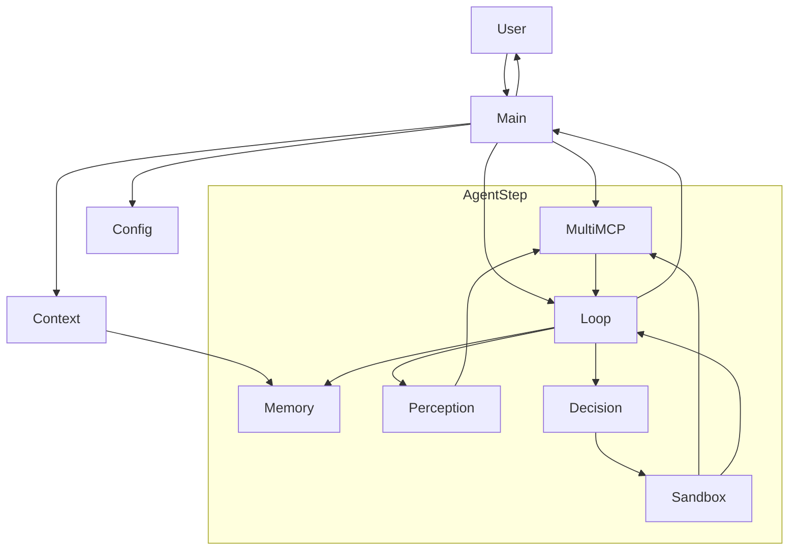

# Hybrid-Agent-Planner
A fully agentic Hybrid Planning system using LLM reasoning + heuristic guardrails + adaptive Python plans + memory-aware decision making. Includes conservative strategy execution, tool sandboxing, historical conversation indexing, and introspection-driven multi-step planning.

## 🧠 System Architecture

#### 1. High level

This project is a **Hybrid Planning Agent**:

> User query → Perception (LLM) → Tool selection (MultiMCP) → Decision (LLM plan) → Python sandbox → MCP tools → Memory → Final answer

The agent runs in **discrete steps**. At each step it:

1. Understands the query and picks tool servers (**Perception**).
2. Chooses which tool to call and writes Python glue code (**Decision / Planning**).
3. Executes that Python code in a sandbox that can only talk to tools (**Action**).
4. Updates its **Memory** and either:

   * finishes with `FINAL_ANSWER: ...`, or
   * continues with `FURTHER_PROCESSING_REQUIRED: ...` and another step.

#### 2. Architecture diagram (Mermaid)

### 🔍 What each node stands for 

| Node           | Meaning                                                     |
| -------------- | ----------------------------------------------------------- |
| **User**       | CLI user typing a query                                     |
| **Main**       | `agent.py`                                                  |
| **Config**     | `models.json` + `profiles.yaml`                             |
| **Context**    | `AgentContext` (state, strategy, memory linkage)            |
| **MultiMCP**   | Tool dispatcher loading all MCP servers                     |
| **Loop**       | `AgentLoop.run()` (perception → decision → action → memory) |
| **Perception** | `modules/perception.py` LLM intent + server selection       |
| **Decision**   | `modules/decision.py` LLM writes Python solve() code        |
| **Sandbox**    | `modules/action.py` executes plan safely                    |
| **Memory**     | `modules/memory.py` logging, success history                |

---

#### 3. Components

* **`agent.py`**
  CLI entry point.

  * Loads `profiles.yaml` and `models.json`.
  * Creates a shared `MultiMCP` dispatcher and calls `initialize()` to discover tools from all MCP servers.
  * For each user query:

    * Builds an `AgentContext` (user input, session id, strategy profile, dispatcher, memory manager).
    * Creates an `AgentLoop(context)` and awaits `run()`.
    * Handles:

      * `FINAL_ANSWER: ...` → print and finish.
      * `FURTHER_PROCESSING_REQUIRED: ...` → feed that back in as the next `user_input` and keep going.

* **`core/context.py`**
  Holds **all state** for a run:

  * `AgentProfile` and `StrategyProfile` are loaded from `profiles.yaml` (planning mode, max steps, lifelines, memory flags).
  * `AgentContext` tracks:

    * `user_input`, `session_id`, `step`
    * `agent_profile` (strategy and persona)
    * `memory = MemoryManager(session_id=...)`
    * `dispatcher` (the shared `MultiMCP`)
    * `mcp_server_descriptions` (for perception prompt)
    * `task_progress` (simple introspection: per step tool + status)
    * `final_answer`
  * Provides helpers like `add_memory`, `log_subtask`, and `update_subtask_status`.

* **`core/session.py`** – MCP dispatch layer

  * `MCP` wraps a single FastMCP server, using `ClientSession` over stdio to:

    * `list_tools()`
    * `call_tool(name, arguments)`
  * `MultiMCP` aggregates all servers from `profiles.yaml`:

    * At `initialize()` time it starts each server once, calls `list_tools()`, and builds:

      * `tool_map[tool_name] = {config, tool}`
      * `server_tools[server_id] = [tools...]`
    * At runtime:

      * `call_tool(tool_name, arguments)` runs the specific server script via stdio and calls that tool.
      * `get_tools_from_servers(selected_servers)` returns tool objects that perception decided to use.

* **`modules/perception.py`** – Perception

  * Builds a prompt from `perception_prompt.txt` with the list of available MCP servers and the user query.
  * Uses `ModelManager` (Gemini or Ollama) to generate a JSON block with:

    * `intent`, `entities`, `tool_hint`, `tags`, and `selected_servers` (list of server ids).
  * `run_perception(...)` returns a `PerceptionResult` that drives tool selection.

* **`modules/decision.py`** – Decision and plan generation

  * Reads the appropriate decision prompt (conservative or exploratory) using `load_prompt`.
  * Injects `tool_descriptions` and `user_input` into that template.
  * Uses `ModelManager` to generate **Python code** that defines `solve()`.
  * Cleans fenced blocks and checks that a `def solve(...):` actually exists.
  * Returns the raw code string (the “plan”).

* **`modules/action.py`** – Python sandbox

  * Defines `run_python_sandbox(plan, dispatcher)` which:

    * Wraps the real `MultiMCP` in a `SandboxMCP` that:

      * exposes `await mcp.call_tool(tool_name, input_dict)`
      * enforces a max number of tool calls per plan.
    * Creates a fresh `ModuleType` and injects:

      * `mcp = SandboxMCP(dispatcher)`, `json`, `re`.
    * `exec`s the generated code to load `solve()` and then runs it.
    * Normalises return values to a string:

      * `dict` → `result["result"]` or JSON string
      * `list` → `" ".join(list)`
      * everything else → `str(value)`
    * Captures exceptions and returns `[sandbox error: ...]`.

* **`modules/memory.py` + `core/context.py`** – Memory

  * `MemoryManager` writes JSON files under `memory/<year>/<month>/<day>/session-<session_id>.json`.
  * Each `MemoryItem` has a type:

    * `run_metadata`, `tool_call`, `tool_output`, `final_answer`
  * The agent stores:

    * tool calls and outputs (plus success flag)
    * final answers
    * simple run metadata.
  * This will later power your historical index and memory MCP server.

* **`core/loop.py`** – AgentLoop controller

  * Uses `max_steps` and `max_lifelines_per_step` from the strategy profile.
  * For each step:

    1. **Perception**

       * `run_perception(context, user_input_override or user_input)`
       * Use `selected_servers` to fetch tools via `MultiMCP`.
    2. **Planning**

       * `summarize_tools(selected_tools)`
       * `select_decision_prompt_path(...)`
       * `generate_plan(...)` to get Python code for `solve()`.
    3. **Execution**

       * If plan defines `solve()`, run it via `run_python_sandbox(...)`.
       * Interpret result:

         * `"FINAL_ANSWER:"` → store in memory, return.
         * `"FURTHER_PROCESSING_REQUIRED:"` → build a new meta `user_input_override` instructing the next step what to do.
         * `"[sandbox error:"` or invalid plan → mark failure and use another lifeline.
  * When steps or lifelines are exhausted, returns
    `FINAL_ANSWER: [Max steps reached]`.
